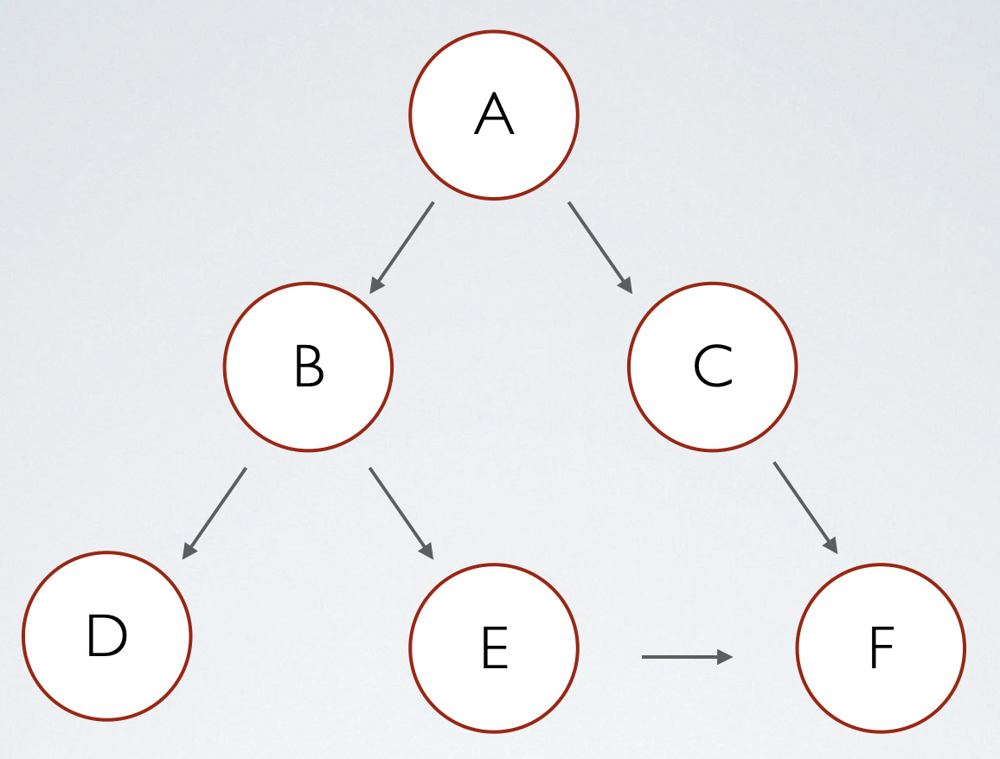
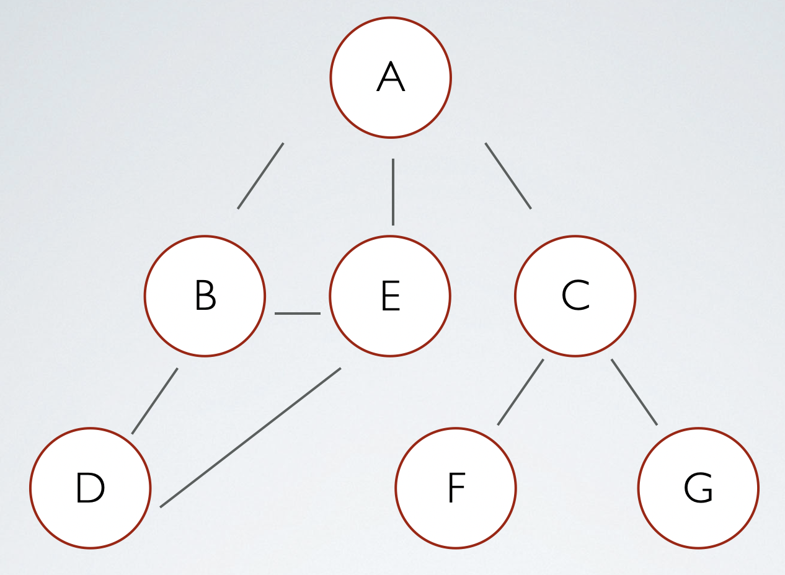

# Search Algo
탐색 알고리즘 정리, 매일, 매일 알고리즘을 풀다 보니 지속적으로 코딩테스트에 나오는 문제가 있는데 바로, 경로찾기 문제이다.
DFS 나 BFS 혹은 Dijkstra 좀 더 나아가 Kruskal's Algorithm 총 이 4개의 알고리즘을 모두 알고 있다면 코딩테스트에서
좋은 결과를 얻지 않을까 싶어 정리한다. 하나씩 한번 알아보자

1.DFS 
+ DFS 란 무엇인가 ?, 왜 쓰는 것인가?
+ DFS Implementation in Python3

2.BFS
+ BFS 란 무엇인가 ?, 왜 쓰는 것인가?
+ BFS Implementation in Python3 

3. Dijkstra 
+
+

4. Kruskal's Algorithm 
+
+

## DFS (Depth-first search )

### DFS 란 ? What is DFS ?

DFS, is an algorithm for tree traversal on graph or tree data structures. It can be implemented easily using recursion and data structures like dictionaries and sets.
It usually used when you want to visit all nodes.

DFS 는 트리 구조 혹은 트리 순회 구조 알고리즘이다. 이는 리커션(재귀) 혹은 Dictionary 나 set() 함수로 쉽게 구현 가능하다.
주로 모든 노드를 방문하고자 할때 이용한다. 
> 인접 노드를 리스트로 구현할 때, 행렬로 구현할 때, 시간 복잡도가 달라지는데
> 리스트일 경우 : O(N+E), 행렬일 경우 : O(N^2)

### Implementation, 구현

</img>

<pre>

# Using a Python dictionary to act as an adjacency list
# 파이썬 Dictionary를 사용하여 인접 노드를 표현 
graph = {
    'A' : ['B','C'],
    'B' : ['D', 'E'],
    'C' : ['F'],
    'D' : [],
    'E' : ['F'],
    'F' : []
}

# visited 는 Set을 통해 방문한 노드를 유지한다.
visited = set() # Set to keep track of visited nodes.

def dfs(visited, graph, node):
    if node not in visited:
        print (node)
        visited.add(node)
        for neighbour in graph[node]:
            dfs(visited, graph, neighbour)
# Driver Code
# A 부터 시작해서 이동 
dfs(visited, graph, 'A')

</pre>

<pre>
Result : A B D E F C 
</pre>

## BFS (Breadth-first search)

### BFS 란 ? What is BFS ?

Breadth-first search (BFS) is an algorithm used for traversing graph data structures. In other words,  BFS implements a specific strategy for visiting all the nodes (vertices) of a graph – more on graphs in a while. What is this exploration strategy? It’s very simple and effective. BFS starts with a node, then it checks the neighbours of the initial node, then the neighbours of the neighbours, and so on. In case you didn’t recall it, two vertices are ‘neighbours’ if they are connected with an edge.

BFS 는 순회 그래프 데이터 구조에서 사용되는 알고리즘이다. 즉, BFS는 모든 그래프의 노드들을 방문하기 위해  구현한 것이다. 그렇다면 어떤 전략을 이용해서 알고리즘이 이루어져 있을까? 이는 매우 쉽고 효과적인 방법인데, BFS는  첫 노드에서 시작하여 이웃한 노드를 체크하고, 그리고 그다음 노드에서 이웃한 노드를 체크하고 계속해서 이런식으로 길을 찾아간다. 마지막 노드일 경우, 다시 함수를 호출하지 못한다. 

BFS is an AI search algorithm, that can be used for finding solutions to a problem. Indeed, several AI problems can be solved by searching through a great number of solutions. The reasoning process, in these cases, can be reduced to performing a search in a problem space. 

BFS는 AI 탐색 알고리즘으로 주로 사용된다. 게다가 많은 AI문제는 수 많은 솔루션들을 통해 해결할 수 있는데, 추론 과정 속에 문제가 생긴 곳에서 검색을 수행한다면 많은 해결책들을 찾는 행위를 축소 할 수 있다. 

### 구현 , Implementation

</img>

<pre>
graph = {'A': ['B', 'C', 'E'],
         'B': ['A','D', 'E'],
         'C': ['A', 'F', 'G'],
         'D': ['B'],
         'E': ['A', 'B','D'],
         'F': ['C'],
         'G': ['C']}
         
         
# visits all the nodes of a graph (connected component) using BFS
def bfs_connected_component(graph, start):
    # keep track of all visited nodes
    explored = []
    # keep track of nodes to be checked
    queue = [start]
 
    # keep looping until there are nodes still to be checked
    while queue:
        # pop shallowest node (first node) from queue
        node = queue.pop(0)
        if node not in explored:
            # add node to list of checked nodes
            explored.append(node)
            neighbours = graph[node]
 
            # add neighbours of node to queue
            for neighbour in neighbours:
                queue.append(neighbour)
    return explored
 
bfs_connected_component(graph,'A') # returns ['A', 'B', 'C', 'E', 'D', 'F', 'G']

</pre>